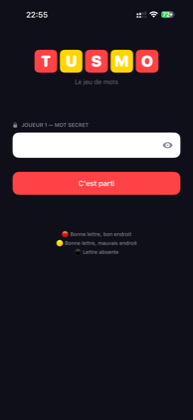
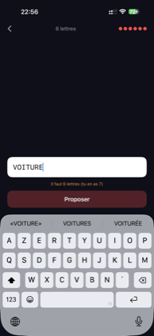
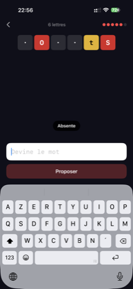
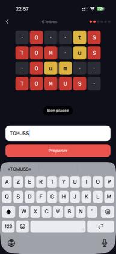
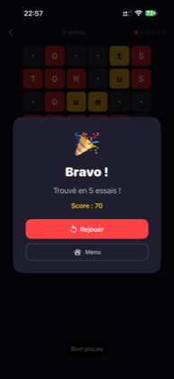

# Tusmo

Tusmo est un petit jeu de mots en SwiftUI, dans l'esprit de Motus, avec une
progression automatique et plusieurs façons de jouer.

En solo, le joueur choisit un thème puis tente de retrouver le mot secret. En
2 joueurs, un premier joueur écrit le mot et le second tente de le retrouver.
Après chaque proposition, les lettres changent de couleur : rouge quand la
lettre est au bon endroit, jaune quand elle existe ailleurs dans le mot,
sombre quand elle n'est pas présente.

J'ai aussi fait une version en Python, jouable dans le terminal, et une autre en p5.js.

## Aperçu

  
  
  
  
  

## Ce qu'on peut faire

- saisir un mot secret sans l'afficher à l'autre joueur ;
- deviner un mot de 1 à 9 lettres ;
- voir les indices lettre par lettre après chaque essai ;
- toucher une case pour revoir sa signification ;
- rejouer directement après une victoire ou une défaite.
- jouer avec les personnages des Simpsons ou de South Park ;
- retrouver des produits et services Apple, des pays ou des objets de la maison ;
- profiter d'au moins 70 mots uniques dans les thèmes généralistes ;
- jouer avec une banque Apple volontairement limitée à 50 termes réellement
  liés à la marque ;
- classer les termes par familiarité, du niveau Débutant aux références de
  niveau Maître, indépendamment du nombre de lettres ;
- calibrer chaque thème avec une progression éditoriale complète : références
  évidentes en France, termes courants, puis références spécialisées ;
- afficher la difficulté éditoriale du mot dans une pastille dédiée pendant
  la partie ;
- commencer chaque thème par quelques références emblématiques, puis ouvrir
  progressivement les termes moins connus ; les termes français ont été
  vérifiés à partir de la distinction facile/moyen/difficile de
  [Undercover](https://undercover.gg/fr/words) ;
- voir une progression de 0 à 100 % par thème et retrouver uniquement des mots
  qui n'ont pas encore été devinés ;
- progresser automatiquement du niveau Débutant au niveau Maître, séparément
  pour chaque thème ;
- créer plusieurs profils, chacun avec sa propre progression et ses records ;
- choisir le thème Pokémon puis une génération de la I à la IX ;
- jouer un tournoi de cinq manches et conserver le score final ;
- jouer en mode « Le plus loin possible », en choisissant entre encaisser ses
  points ou continuer avec un multiplicateur plus élevé — une défaite fait
  perdre tous les points en jeu.

## Lancer le projet

Ouvre `Tusmo.xcodeproj` avec Xcode, puis lance la cible `Tusmo` sur un simulateur iPhone ou un appareil iOS.

Le projet ne dépend pas d'un paquet externe. La logique d'interface est dans
`Tusmo/ContentView.swift`, les profils et niveaux dans
`Tusmo/Progression.swift`, et la banque de mots dans `Tusmo/Mots.swift`.

## Règles de couleur

Rouge : bonne lettre, bon endroit.

Jaune : bonne lettre, mauvais endroit.

Sombre : lettre absente du mot secret.

## Structure

`Tusmo/TusmoApp.swift` contient le point d'entrée de l'app.

`Tusmo/ContentView.swift` contient le menu, les profils, les sélecteurs de
mode, l'écran de jeu, le calcul des indices et les fenêtres de fin de partie.

`Tusmo/Progression.swift` contient les cinq niveaux de difficulté, les modes
de jeu, le modèle de profil, la progression par thème et la sauvegarde locale
des profils.

`Tusmo/Mots.swift` contient les thèmes et le tirage d'un mot adapté au niveau
du profil actif. Chaque banque est ordonnée du terme le plus connu au plus
spécifique et chaque terme reçoit un poids de notoriété indépendant de sa
longueur.

`Tusmo/Pokemon.swift` contient les banques de Pokémon des générations I à IX
et leur tirage par niveau.

`docs/screenshots` contient les captures utilisées dans ce README.
